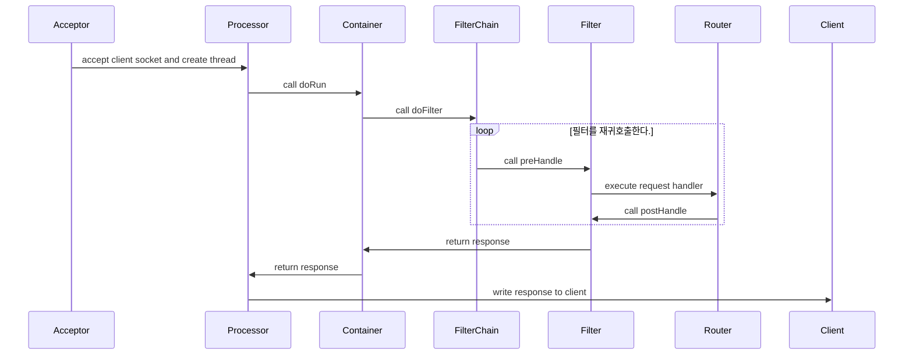

# Java WAS

2024 우아한 테크캠프 프로젝트 WAS

## 구현 내용

- Component Scan 구현
    - `@Solo` 어노테이션이 선언된 클래스를 스캔하여 싱글톤으로 등록합니다.
    - DI를 지원하여 등록된 객체에 필요한 의존성을 자동으로 주입해줍니다.

- Trie 기반 라우팅 구현
    - 요청에 필요한 핸들러를 찾을 때, Trie를 통해서 빠르게 핸들러를 찾아냅니다.

- SSR 구현을 위해 Http Element tree 구조 구현
    - templates 패키지에서 관련 클래스가 존재합니다.

- FilterChain 구현
    - filters 패키지에서 관련 클래스가 존재합니다.
    - 정의된 필터 순서에 따라서 필터가 실행됩니다.

- RouterConfig에 정의된 라우팅 정보를 바탕으로 요청에 대한 핸들러를 실행

## 요청 처리 흐름



## template 지원 문법

html에 커스텀 속성을 이용한 템플릿을 지원합니다.

### 값 매핑

표현식에서 사용할 값은 다음과 같은 형태로 나타냅니다.

- String(value) : value 값을 가지는 문자열을 나타냅니다.
- 숫자 : int 범위의 숫자를 나타낼 수 있습니다.
- null : null을 나타냅니다.
- session.{{key}} : 세션에 존재하는 key 객체를 반환합니다.
- {root}.{subroot}.{key}: 모델의 값을 `.`을 통해서 조회할 수 있습니다.

### 지원 속성

1. `woowa-if` : 해당 속성의 표현식이 True이면 랜더링 false이면 제거
    - `==`, `!=`, `<`, `>` 연산을 지원합니다.
    - Example) `session.user == null`

```html

<ul class="header__menu" woowa-if="session.user != null">
    <li class="header__menu__item">
        <a class="btn btn_contained btn_size_s" href="/article">
            글쓰기
        </a>
    </li>
</ul>
```

2. `woowa-value` : 해당 속성의 표현식에 매핑되는 값을 주입해줍니다.

```html
<p class="post__account__nickname" woowa-value="session.user.nickname">account</p>
```
