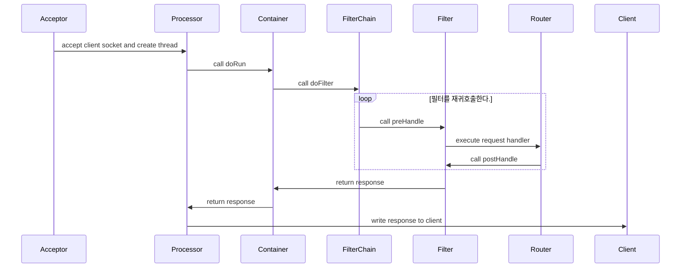

# Java WAS

2024 우아한 테크캠프 프로젝트 WAS

## 구현 내용

- SSR 구현을 위해 Http Element tree 구조 구현
  - templates 패키지에서 관련 클래스가 존재합니다.
- FilterChain 구현
  - filters 패키지에서 관련 클래스가 존재합니다.
  - 정의된 필터 순서에 따라서 필터가 실행됩니다.
- RouterConfig에 정의된 라우팅 정보를 바탕으로 요청에 대한 핸들러를 실행

## 요청 처리 흐름

